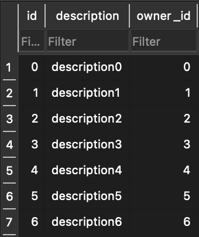

# Testing of SQLModel Lib

## Basic Properties

- It is following all the properties of the field of an SQL
- Giving all the required error, ie. related to primary key, null field etc.

## Foreign key problem

- we created a list of users and chats
- some of these chats have user.id which id not in the actual user id.
- we are adding it one by one, and committing it once at the end.

### Models
- The models used are:
```python
class VSQLModel(SQLModel):
    model_config = {
        "validate_assignment": True,
    }

class User(VSQLModel, table=True):
    id: int = Field(default=None, primary_key=True)
    name: str
    email: str
    hashed_password: str = Field(default=None, nullable=True)

class Chats(VSQLModel, table=True):
    id: int = Field(default=None, primary_key=True)
    description: str
    owner_id: int = Field(foreign_key="user.id")
```

### Result on `test.py`
- The result is:


- `test.py` was executed without any errors.
- Even after adding 90 and 100 as the `owner_id`, it is still not asserting `FOREIGN KEY ERROR` and committing it to the database.

### Solution

- after going through docs and using ChatGPT, found a solution for this problem
- We need to add some lines to enable `foreign keys` property of the database.
```python
from sqlalchemy import event

@event.listens_for(engine, "connect")
def enable_foreign_keys(dbapi_connection, connection_record):
    cursor = dbapi_connection.cursor()
    cursor.execute("PRAGMA foreign_keys=ON")
    cursor.close()
```
- these lines were added in `test2.py` and were tested again.

### Result on `test2.py`

- The result is:




- during the execution of `test2.py`, below error was generated
```
sqlalchemy.exc.IntegrityError: (sqlite3.IntegrityError) FOREIGN KEY constraint failed
[SQL: INSERT INTO chats (id, description, owner_id) VALUES (?, ?, ?)]
[parameters: (7, 'description', 90)]
(Background on this error at: https://sqlalche.me/e/20/gkpj)

```
- This time , when we were adding 90 as the `owner_id`, it was showing error.


